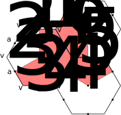
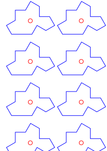

# Aperiodic monotiles

This project generates two SVG files including a batch of aperiodic monotiles: one with *hat polykites* and one with *Tile(1,1).* It uses the [cairo-fortran](https://github.com/vmagnin/cairo-fortran) bindings as a fpm (Fortran Package Manager) dependency.

You can then cut a paper print with scissors, but cutting polygons with 13 edges is rather tedious... The ultimate goal would be to use laser cutting to create aperiodic puzzles using wood or plexiglas. But you can also simply open the SVG file into a SVG editor like [Inkscape](https://inkscape.org/) and ungroup the drawing to translate and rotate each polygon to play puzzle.

## The ein Stein problem

The mathematical problem *ein Stein* (German for "a stone") poses the following question: is there a geometrical shape that admits aperiodic tilings of the plane?

In 1966, the mathematician Robert Berger built a set of 20426 tiles which he later reduced to 104. In 1974, the physicist Roger Penrose published a pair of polygons admitting aperiodic tilings of the plane, with a symmetry of order 5. And in 1982, quasi-crystals with symmetry of order 5 were discovered in an aluminum/manganese alloy, something previously thought impossible in the dogma of crystallography.

On March 20, 2023, David Smith and mathematicians Joseph Samuel Myers, Craig S. Kaplan and Chaim Goodman-Strauss posted a [preprint on ArXiv](http://arxiv.org/abs/2303.10798) describing a monotile with 13 sides that, used with its reflected version, admits aperiodic tilings of the plane: the *"hat" polykite.*

On May 28, 2023, they deposited a [second preprint on arXiv](https://arxiv.org/abs/2305.17743) describing aperiodic tiling of the plane using a single chiral (tiling the plane without its reflected version) fourteen-sided shape, named *Tile(1,1).* They have finally found the Grail! In fact, if you use both Tile(1,1) and its reflected shape, the tiling will be periodic. If the reflected shape is prohibited, the tiling is aperiodic. And by replacing the edges of Tile(1,1) by curves, you can obtain the Spectre which admits aperiodic tiling of the plane, but no tiling if you use it with its reflected shape. See also that page from the authors: https://cs.uwaterloo.ca/~csk/spectre/

Open question: is there such shapes with fewer sides?

## Building the hat using three hexagons



## Building the Tile(1,1)

It is derived from the hat, but all the 14 edges have the same length (but in fact one of them is divided in two segments). All the angles are multiples of 30°.




## Requirements and dependencies

You need:

* a modern Fortran compiler, for example GFortran or the Intel ifort/ifx compilers. See the [Fortran-lang.org compilers page](https://fortran-lang.org/compilers/) for other compilers.
* The Cairo development files (`libcairo2-dev` package in Ubuntu).
* The Fortran Package Manager [fpm](https://fpm.fortran-lang.org/).

## Running the program

```bash
$ fpm run
 + mkdir -p build/dependencies
Initialized empty Git repository in hat_polykite/build/dependencies/cairo-fortran/.git/
remote: Enumerating objects: 23, done.
remote: Counting objects: 100% (23/23), done.
remote: Compressing objects: 100% (22/22), done.
remote: Total 23 (delta 0), reused 14 (delta 0), pack-reused 0
Unpacking objects: 100% (23/23), 82.93 KiB | 3.61 MiB/s, done.
From https://github.com/vmagnin/cairo-fortran
 * branch            HEAD       -> FETCH_HEAD
hexagon_class.f90                      done.
cairo-auto.f90                         done.
cairo-enums.f90                        done.
tile_class.f90                         done.
libhat_polykite.a                      done.
main.f90                               done.
hat_polykite                           done
[100%] Project compiled successfully.
 -----------------------------
 Output file: hat_polykite.svg
```


## Licenses

This project is licensed under the [GNU General Public License version 3 or later](http://www.gnu.org/licenses/gpl.html).

The documentation is under the [GNU Free Documentation License 1.3 or any later version](http://www.gnu.org/licenses/fdl.html). The figures are under [CC-BY-NC-SA 4.0](https://creativecommons.org/licenses/by-nc-sa/4.0/) license.

## Cairo documentation

* https://cairographics.org/documentation/
* API Reference Manual: https://cairographics.org/manual/

## Bibliography

* Roger Penrose, Set of tiles for covering a surface, Patent GB1548164A ([US-4133152-A](https://patents.google.com/patent/US4133152A/en)), filed 1975-06-25.
* Hargittai, Istvan, et Balazs Hargittai. « 2020 Physics Nobel Laureate Roger Penrose and the Penrose Pattern as a Forerunner of Generalized Crystallography ». *Structural Chemistry* 32, no.1 (1st February 2021): 1‑7. https://doi.org/10.1007/s11224-020-01669-8
* Smith, David, Joseph Samuel Myers, Craig S. Kaplan, and Chaim Goodman-Strauss. "An Aperiodic Monotile". 20th March 2023. http://arxiv.org/abs/2303.10798
* Smith, David, Joseph Samuel Myers, Craig S. Kaplan, and Chaim Goodman-Strauss. "A chiral aperiodic monotile". 28th May 2023. https://arxiv.org/abs/2305.17743
* https://cs.uwaterloo.ca/~csk/spectre/
* https://en.wikipedia.org/wiki/Einstein_problem
* https://en.wikipedia.org/wiki/Penrose_tiling
